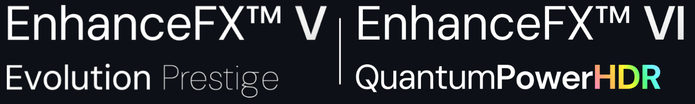
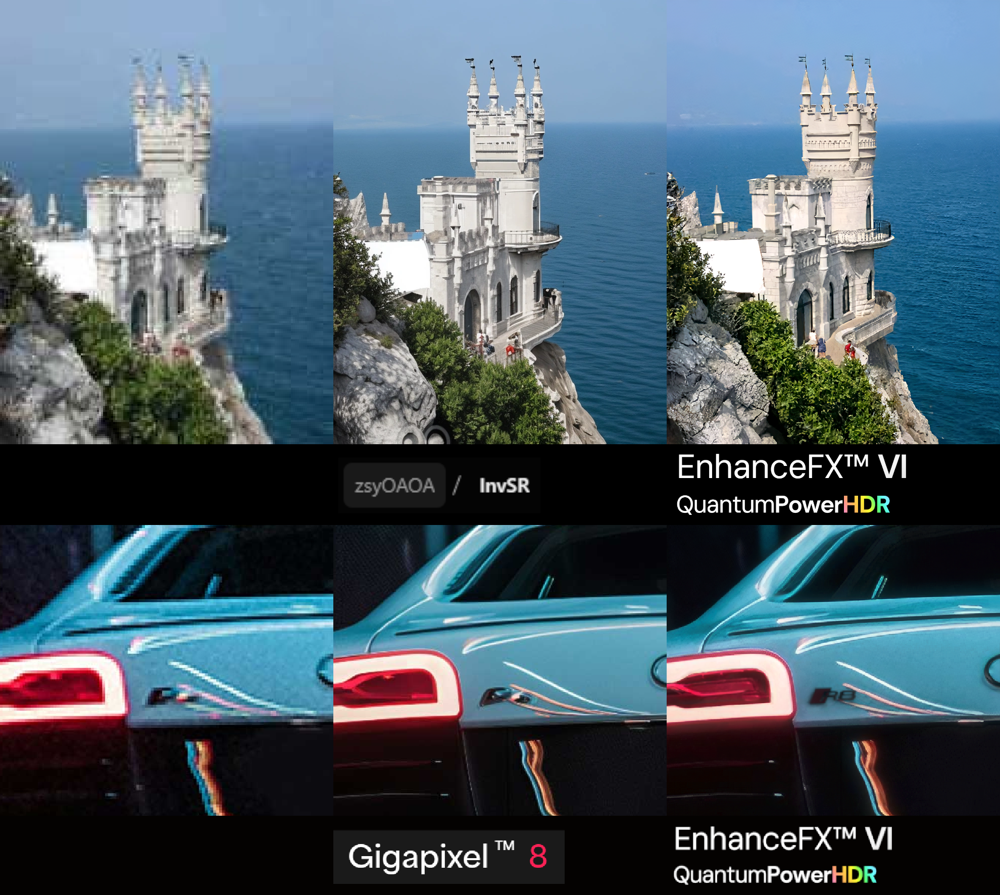

  

# Hyper-Quality, Advanced Contextual Upscaling. The EnhanceFX™ Series.

# Model Card

Version: 5.1.7 & 6.0.1

EnhanceFX™ V Evolution Prestige is a hybrid super-resolution model crafted in PyTorch. It uses a combination of advanced neural network techniques and proprietary elements to deliver outstandingly sharp 16x upscaling, designed to extract both global and fine details effectively, while intelligently enhancing contextual information.

EnhanceFX™ VI doesn’t just upscale – it understands. It takes the time to think, powered by the ‘ViRAU’ dynamic activation function (5+ years in the making), and an advanced, proprietary *hybrid* Transformer core designed for unmatched *razor-sharp and ultra-noiseless* precision. EnhanceFX™ VI adapts to your ideal image, delivering outstanding results. Tested against leading upscaling solutions, EnhanceFX™ VI marks a leap forward in intelligent image enhancement, ensuring precise, detailed, and lifelike results. [1]

## Strengths

- 💡 Hybrid Super-Resolution Architecture: Combines an advanced hybrid core and proprietary elements for outstanding 16x+ upscaling.
- 🧠 Intelligent Upscaling: Provides context-aware detail generation, adapting to a wide range of image types.
- 🌈 Quantum-Based HDR Processor: Delivers extended dynamic range with unparalleled, lifelike color fidelity.
- 🎯 Optimally Tuned Parameters: Designed for balanced generator and discriminator performance. (Specific parameter counts undisclosed for VI)
- ✨ Novel Dynamic Activation Function: An in-house developed activation function; ‘ViRAU’ (VI only).
- ⚙️ Hardware-Level Optimisations: Comes with optimised runtimes for superior performance and efficiency.
- 🛠️ Augmented AD: Dynamic auto-differentiation tailored to ‘ViRAU’.

## Current Progress

This is the 5th/6th iteration in development. Impressive results so far, with improvements still in progress:

- Issues to Address: Vanishing gradients, ISO-style noise artefacts, and colour leaks.
- Proposed Fixes: Research and development focuses on improving network gradient flow and communication between layers.

Update for VI: These issues are being resolved.

## Images

  

EnhanceFX™ VI's intelligent upscaling accurately identifies key elements in the test cases, enabling it to generate highly convincing details that can deceive even top-tier discriminators; sometimes, humans!

Both architectures (V/VI) are actively being developed, and the images are **strictly** early-stage results. Final performance and output quality may improve with ongoing research and optimisations.

## FAQ

(Based on questions I have received at university)

**Q: Why is there no source code?**

A: Unlike NeuralWorks and NeuralWorksCustom, I’ve chosen not to make the source code public for collaboration at this time. This decision is primarily for IP protection due to novelty, and I want to further research and refine the model before releasing anything. I'm focused on ensuring that EnhanceFX™ reaches its full potential before making it publicly available, under the EnhanceFX™ proprietary license.

**Q: Does the complexity of the architecture lead to diminishing returns in performance?**

A: Complex architectures can lead to diminishing returns, especially when the overhead of training time and resource consumption outweighs the benefits. However, experimentation with modular design, ensures the architecture is effective and optimized for efficiency.

**Q: This all seems too complicated, unrealistically impossible to train and illegitimate!**

A: This is a valid point/concern. The architecture is crafted with a focus on modularity and efficiency, with components that can be selectively activated or deactivated to optimise computational resource usage. Iterative development and thorough testing at multiple scales ensure that complexity is introduced thoughtfully. Achieving high-quality results has been successfully demonstrated. I have a **fully trained** set of weights and **architecture definitions** for testing purposes on my clusters.

**Q: Would you elaborate more on the architecture specifics?**

A: While I understand this is interesting, efforts in protecting my IP have been made. This does not preclude potential academic publications further down the line.

Got any other questions? motions.07-busses@icloud.com

Cheers!

UPDATE 19/01/2025: HNY. Terms subject to change in coming months.

# Appendix

## License

Please refer to LICENSE.txt.

## Questions?

Feel free to drop me an email and/or connect on LinkedIn.

motions.07-busses@icloud.com

Feedback is always appreciated and will be recognised!

## Comparison Models, Miscellaneous

- Topaz Gigapixel™ 8 @ https://www.topazlabs.com/gigapixel
- InvSR @ https://github.com/zsyOAOA/InvSR
- EnhanceFX™ V only: https://imgsli.com/MzAwNDM2

## Legal & Notices

[1]: EnhanceFX™ VI builds on V, introducing enhanced HDR support and additional new features to be revealed soon. MoE, and X billion + parameter size being considered, but this is not certain!!!

All current repository clones/pulls should be aware of the changes made to the series in light of version 6.0.0 and onwards. V's architecture & card is on track for repo-limited deprecation.

The architectures stand at around 15 billion parameters w/o any modification. This is *not* indicative of performance, and is *not* the size of any test-ready, or working versions of the model series.

Please note that this markdown is more detailed than any other reference to EFXVEP, such as LinkedIn.

© OguzhanCOG: EnhanceFX™ Series, All Rights Reserved.
Refer to the LICENSE.txt file for detailed terms and conditions.
