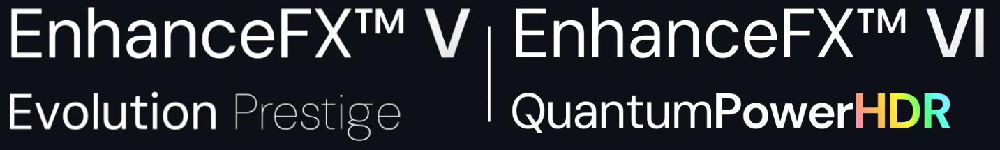
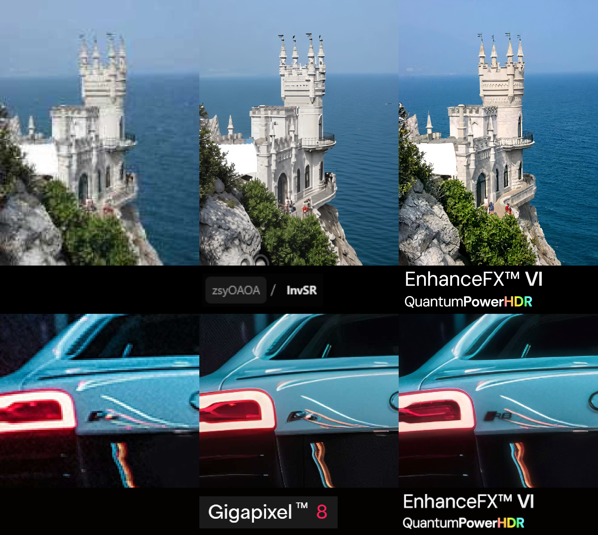

  

# EnhanceFX™ Series: Model Card

Version: 5.1.7 & 6.0.1

EnhanceFX™ V Evolution Prestige is a hybrid super-resolution model crafted in PyTorch. It utilises a combination of state-of-the-art techniques, alongside other optimisations and novelties to deliver outstandingly sharp 16x upscaling, designed to extract both global and fine details effectively, while adding in contextual detail.

EnhanceFX™ VI doesn’t just upscale – it *understands*. With its cutting-edge quantum architecture, it takes the time to *think*, analysing the domain, color dynamics, and semantic cues before *perfecting* every detail. Powered by the ‘ViRAU’ dynamic activation function (5+ years in the making), multiple enhanced attention heads, and a SotA, razor-sharp, ultra-noiseless hybrid Transformer core, EnhanceFX™ VI learns and adapts to your ideal image, delivering outstanding results. Tested against the ***best***, it marks the revolution of smart image upscaling, ensuring precise, detailed, and lifelike enhancement. [1]

## Strengths

- 💡 Hybrid Super-Resolution Architecture: Combines Transformers, RRDBs and other *exclusive* elements for outstanding 16x+ upscaling.
- 🧠 Self-Attention Mechanisms: Custom Transformer blocks help with contextual long-term detail preservation.
- ⚡ Frequency Blocks: Enhanced frequency-domain processing to mitigate noise artefacts.
- 🎯 2-3/0.5-1.5 Billion Parameters: Optimally tuned for both Generator (G) and Discriminator (D) power equality (Undisclosed for VI).
- ✨ Distributed custom upsampler with novel, activation function designed in-house; 'ViRAU' (VI only).

## Current Progress

Based directly on the 8XOne architecture, this is the 5/6th iteration in development. Impressive results so far, with improvements still in progress:

- Issues to Address: Vanishing gradients, ISO-style noise artefacts, and colour leaks between Transformers.
- Proposed Fixes: Recursive block interconnects (as a modification or addition to the existing blocks) improve Transformer coordination by promoting better gradient flow and effective communication between layers.

Update for VI: The issues listed above are due to be rectified.

## Images

  

EnhanceFX™ VI with its global semantic context engine accurately identifies the Swallow's Nest and an Audi R8 in the test cases, enabling it to generate highly convincing details that can deceive even top-tier discriminators; sometimes, humans!

Both architectures (V/VI) are actively being developed, and the images are **strictly** early-stage results. Final performance and output quality may improve with ongoing research and optimisations.

## FAQ

(Based on questions I have received at university)

**Q: Why is there no source code?**

A: Unlike NeuralWorks and NeuralWorksCustom, I’ve chosen not to make the source code public for collaboration at this time. This decision is primarily for IP protection due to novelty, and I want to further research and refine the model before releasing anything (This also explains why I **cannot** explain architecture specifics anymore). Academic publications are definitely on the horizon when time permits, but for now, I’m focused on ensuring that EnhanceFX™ reaches its full potential before making it publicly available, under the EnhanceFX™ proprietary license.

**Q: Does the complexity of the architecture lead to diminishing returns in performance?**

A: Complex architectures like EnhanceFX™ can *indeed* lead to diminishing returns, especially when the overhead of training time and resource consumption outweighs the benefits gained from added layers or components. However, combining many exotic systems and experimenting with their interactions promotes deeper architectural research in this field, which is always great to have; I find my architectures through pure experimentation/curiosity!

**Q: This all seems too complicated, unrealistically impossible to train and illegitimate!**

A: This is a valid point/concern. In reality, I've tried to craft the architecture with a focus on modularity and efficiency. Each component is purpose-driven and can be selectively activated or deactivated to optimise computational resource usage in my forward()/backward() methods. The iterative addition of many blocks followed testing phases at multiple scales, ensuring that complexity is introduced thoughtfully (rather than impulsively in response to competition or desire to do so) and without negative repercussions. With the right setup and when the blocks work together, achieving high-quality results is not only feasible but has also been successfully demonstrated (See **Images**). To address legitimacy, I'll mention that I have a **fully trained** set of weights and **architecture definitions** for testing purposes on my clusters.

**Q: Would you elaborate more on the architecture specifics?**

A: While I understand this is interesting, as mentioned above, efforts in protecting my IP have been made. Also addressed above is the potential for a formal, academic, public release.

Got any other questions? motions.07-busses@icloud.com

Cheers!

# Appendix

## License

Please refer to LICENSE.txt.

## Comparison Models, Miscellaneous

- Topaz Gigapixel™ 8 @ https://www.topazlabs.com/gigapixel
- InvSR @ https://github.com/zsyOAOA/InvSR
- EnhanceFX™ V only: https://imgsli.com/MzAwNDM2

## Legal & Notices

[1]: EnhanceFX™ VI QuantumPowerHDR builds on V, introducing quantum processing, HDR support and additional (secret) features to be revealed soon.

All current repository clones/pulls should be aware of the changes made to the series in light of version 6.0.0 and onwards. V's architecture & card is on track for repo-limited deprecation.

Please note that this markdown is more detailed than any other reference to EFXVEP, such as LinkedIn.

© OguzhanCOG: EnhanceFX™ Series, All Rights Reversed.
Refer to the LICENSE.txt file for detailed terms and conditions.
